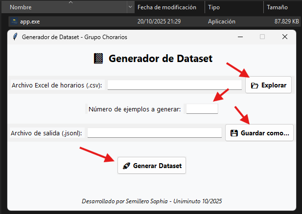

# 📚 Generador de Dataset de Horarios Universitarios

Este proyecto genera un dataset de entrenamiento para modelos de lenguaje que aprenden a proponer horarios académicos sin cruces.

## 🚀 Estructura
- `app.py` → Archivo principal.
- `src/` → Código fuente modularizado.
- `data/` → Archivos Excel de entrada.
- `output/` → Resultados exportados.
- `requirements.txt` → Dependencias.

## ⚙️ Ejecución
1. Instalar dependencias:
   ```bash
   pip install -r requirements.txt

## 📚 Preview de App

